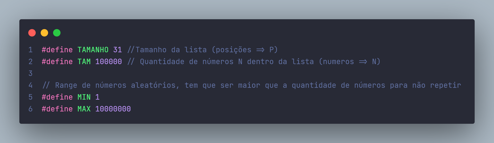
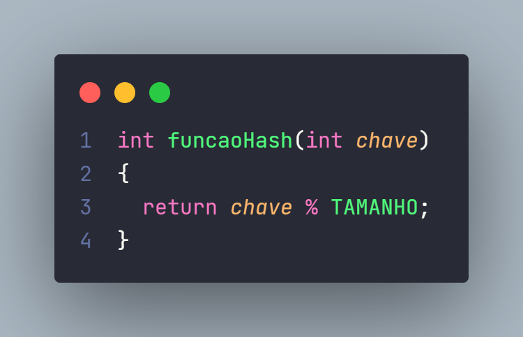
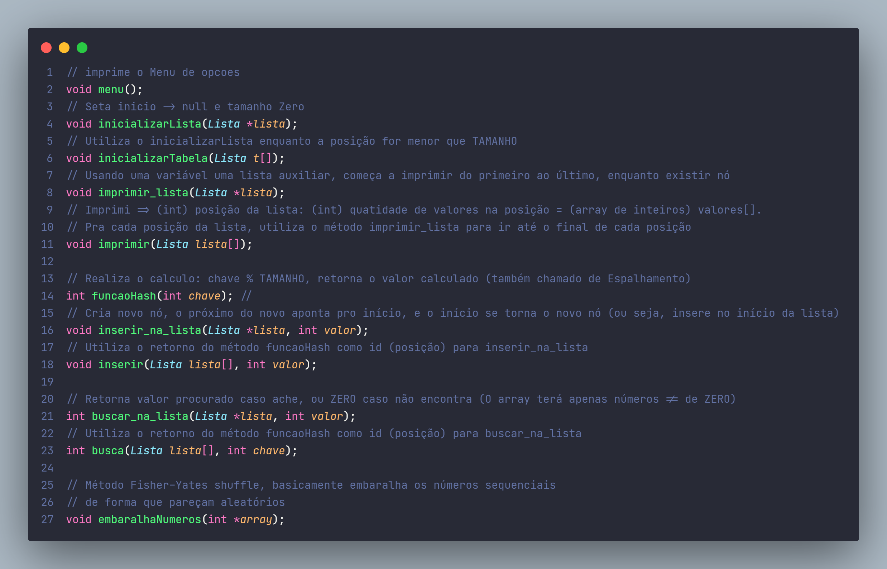

# O trabalho visa: Desenvolver um Hash com calculos lineares e quadráticos
Trabalho para disciplina de Classificação e Pesquisa de dados CEFET-MG (Leopoldina)

 ## Lista encadeada com P posições (N > P)
 Em uma lista encadeada o número de números pode ser muito maior que o de posições (se limitando apenas a memória disponível)
 
 
 
#### Utilizamos o calculo: H(N) = N % P
É preciso ter cuidado com a escolha de P, ○ Exemplo:
- se P é par, então H(N) é par quando N é par e H(N) é ímpar quando N é ímpar;
○ Resumindo, P deve ser primo, mas não qualquer primo.

### Utilizamos as seguintes funções na Lista Encadeada:

